<h1 align="center">🔥 Ember</h1>

<p align="center">
  <b>A WhatsApp-class chat app, built from scratch.</b><br/>
  A hand-rolled <b>Erlang/OTP</b> real-time backend, a native <b>SwiftUI</b> iOS app designed around
  Apple's <b>Liquid Glass</b>, and an installable web app — no frameworks, no external database.
</p>

<p align="center">
  
  
  
  
  
  
</p>

<p align="center">
  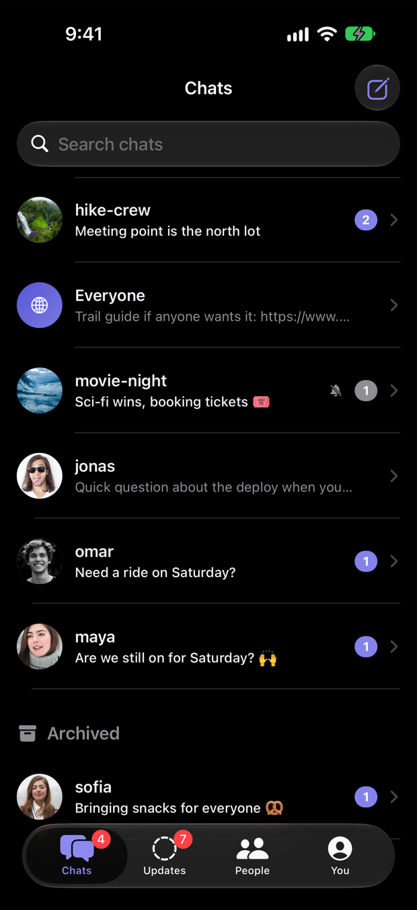
  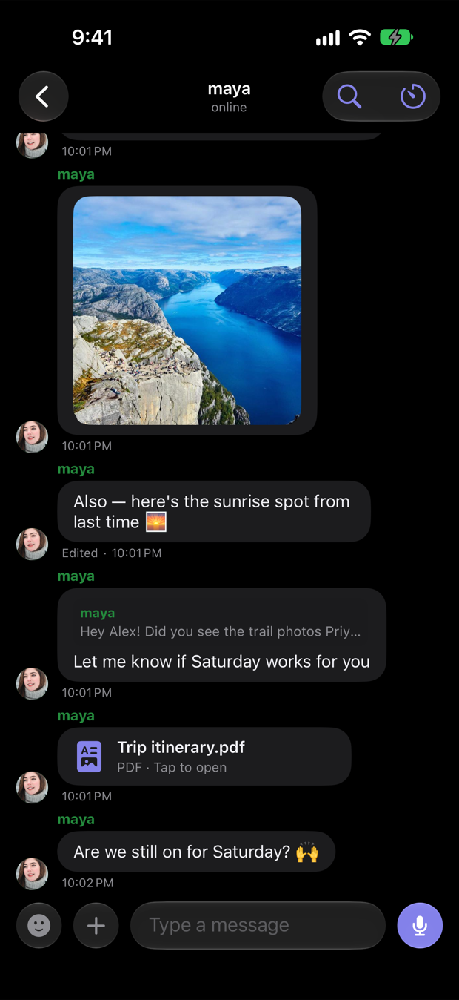
  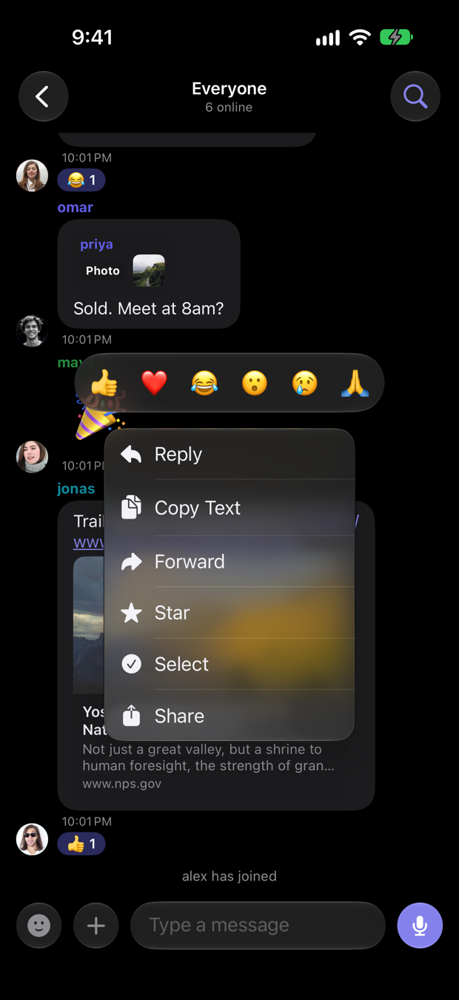
  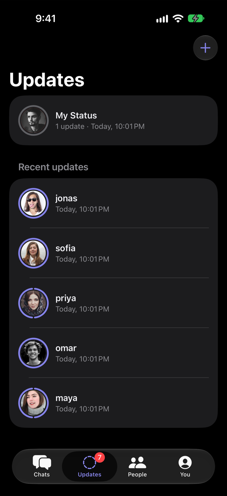
</p>

<p align="center">
  🌐 <a href="https://ember-chat-tofm.onrender.com" target="_blank">Web app (hosted)</a>
  &nbsp;·&nbsp; 📖 <a href="docs/ARCHITECTURE.md">Architecture</a>
  &nbsp;·&nbsp; 📡 <a href="docs/PROTOCOL.md">Protocol</a>
  &nbsp;·&nbsp; 🛠️ <a href="docs/DEVELOPMENT.md">Development</a>
</p>

---

## What it is

Ember is a full messaging app: a global room, private chats, groups, photos, voice notes, PDFs,
reactions, replies, edits, disappearing messages, and 24-hour status updates ("stories"). It exists
to answer *"how much of a real chat product can one person build from first principles?"* — so the
server is plain Erlang/OTP (its own HTTP + WebSocket layer, its own persistence on Mnesia), and the
iOS app is a native SwiftUI client that leans on **iOS 26 Liquid Glass** for its whole chrome.

The interesting engineering is in the seams: a wire protocol designed to be driven by a 100-line test
client, an offline-tolerant client that reconnects and resyncs, and a set of real bugs found by
running scripted users against the app and fixed at the root
([see below](#-engineering-highlights)).

## 📱 Screenshots

The iOS app on iPhone 18 Pro, dark mode. (Demo accounts, placeholder photos — see [credits](#credits).)

<table>
  <tr>
    <td align="center" width="25%">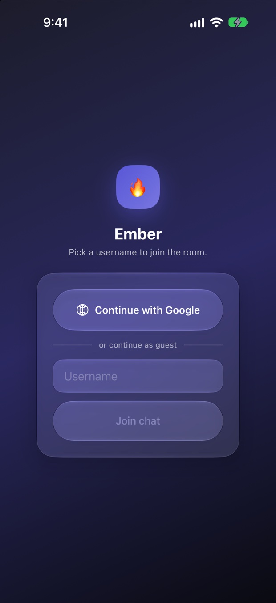<br/><sub><b>Sign in</b><br/>glass card, guest or Google</sub></td>
    <td align="center" width="25%"><br/><sub><b>Chats</b><br/>pinned, muted, archived, unread badges</sub></td>
    <td align="center" width="25%">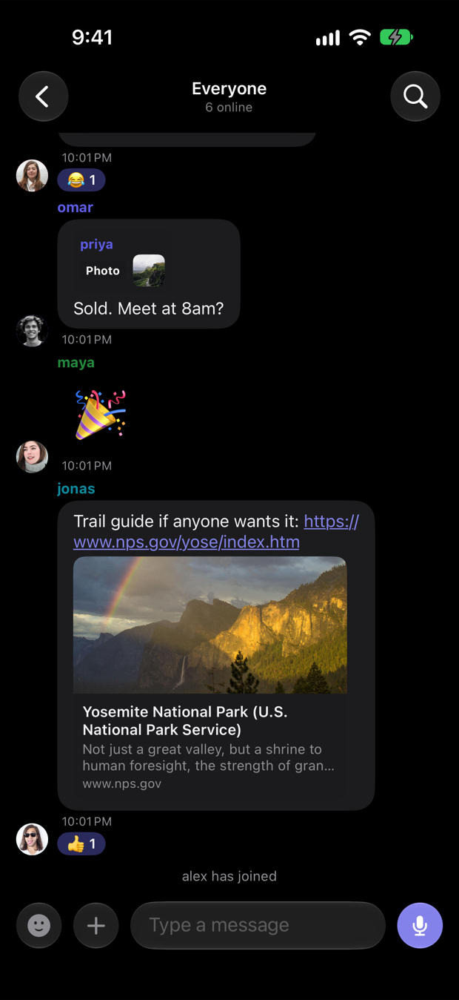<br/><sub><b>Global room</b><br/>reply quotes, big emoji, link cards, reactions</sub></td>
    <td align="center" width="25%"><br/><sub><b>Direct message</b><br/>photo, edited, reply, PDF, timestamps</sub></td>
  </tr>
  <tr>
    <td align="center">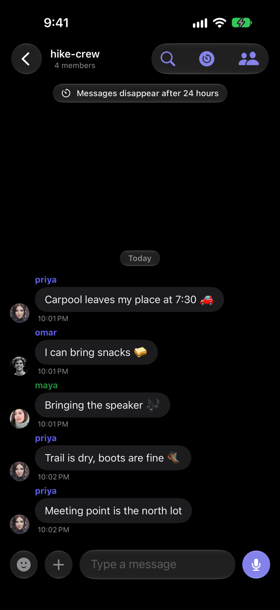<br/><sub><b>Group</b><br/>disappearing-messages banner</sub></td>
    <td align="center">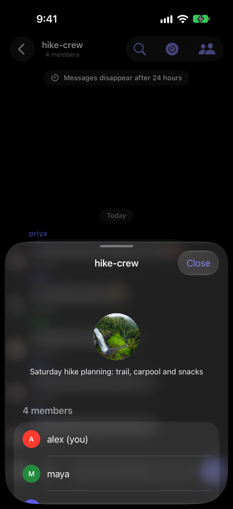<br/><sub><b>Group info</b><br/>owner, icon, description, members</sub></td>
    <td align="center"><br/><sub><b>Long-press</b><br/>reactions, reply, forward, star, select</sub></td>
    <td align="center">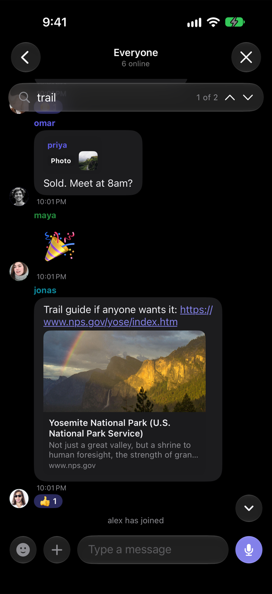<br/><sub><b>In-chat search</b><br/>jump between matches</sub></td>
  </tr>
  <tr>
    <td align="center">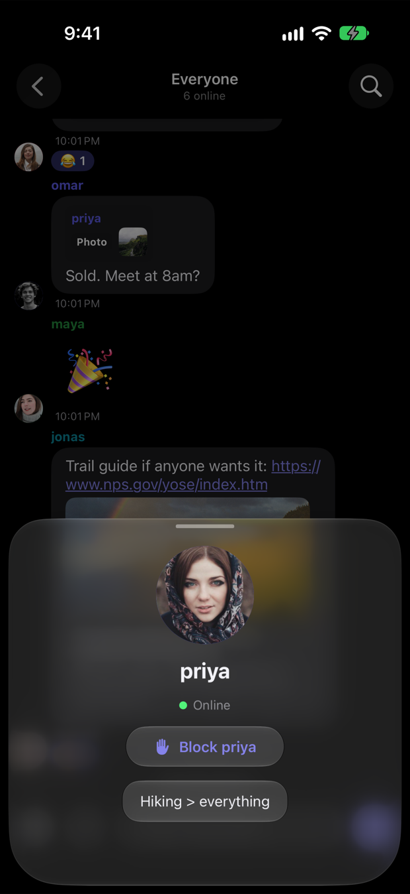<br/><sub><b>Profile card</b><br/>tap any avatar</sub></td>
    <td align="center"><br/><sub><b>Photo viewer</b><br/>pinch, save, share</sub></td>
    <td align="center"><br/><sub><b>Updates</b><br/>segmented rings, unviewed badge</sub></td>
    <td align="center"><br/><sub><b>Story viewer</b><br/>tap, hold to pause, swipe down</sub></td>
  </tr>
  <tr>
    <td align="center">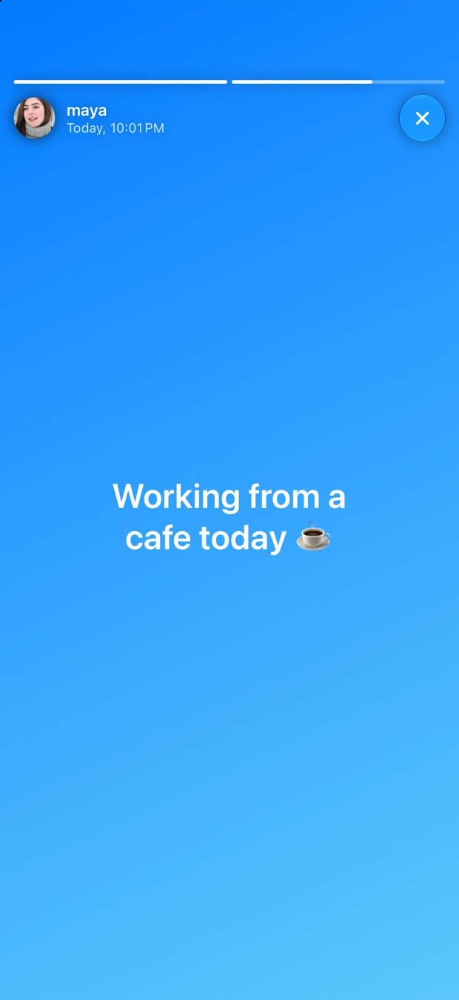<br/><sub><b>Text stories</b><br/>8 gradient backgrounds</sub></td>
    <td align="center">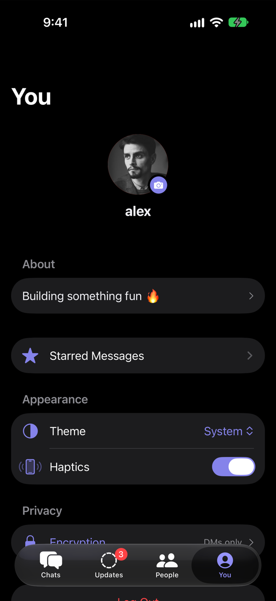<br/><sub><b>You</b><br/>profile, theme, haptics</sub></td>
    <td align="center">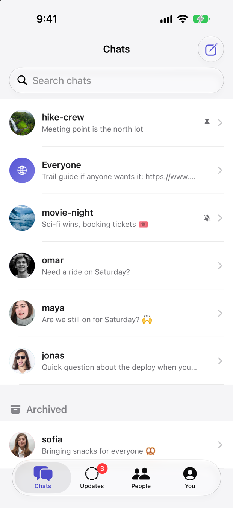<br/><sub><b>Light mode</b><br/>follows the system</sub></td>
    <td align="center">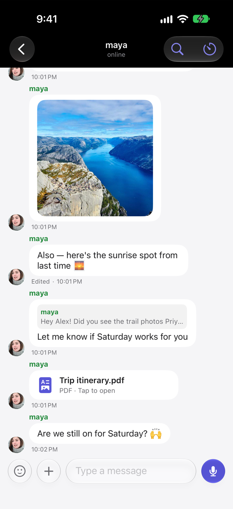<br/><sub><b>Light mode chat</b></sub></td>
  </tr>
</table>

**iPad** gets a real split view — chat list in the sidebar, conversation in the detail pane:

<p align="center">
  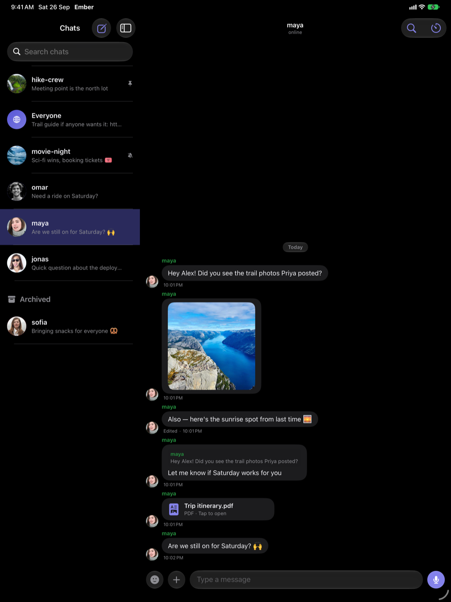
</p>

## ✨ Features

**Messaging**
- Global room, 1:1 direct messages, and groups — each with history, unread counts and previews
- Photos, GIFs & stickers (Giphy), voice notes with live waveform, **PDF documents**, camera, location sharing
- Replies (swipe or long-press, tap the quote to jump to the original), emoji reactions with a "who reacted" sheet
- **Edit** and **delete for everyone** (author only, enforced server-side), forward, star, share, multi-select
- Link previews (Open Graph cards), tappable links, big emoji-only messages, per-message timestamps and day dividers
- Typing indicators, delivery / read ticks on DMs, drafts saved per chat, in-chat search
- **Disappearing messages** (1 minute → 90 days) for DMs and groups

**Chat management**
- Pin, mute, archive, mark as unread, block; unread badges on rows and the tab bar
- DM "last seen"; online state; profile photos and status lines; tap an avatar for a profile card
- Groups with an **owner**, add/remove members, description and icon, live member updates for everyone

**Status updates (stories)**
- 24-hour text (colour gradients) and photo posts, a segmented-ring Updates tab
- Full-screen viewer with auto-advance, tap to skip, hold to pause, swipe to dismiss
- View tracking that only the author can see

**Platform**
- Native **Liquid Glass** UI, light/dark, haptics, iPhone **and** iPad layouts
- **Automatic reconnect** with resync after a dropped connection; local notifications
- **End-to-end encrypted DMs** on iOS (X25519 + AES-GCM); Google sign-in or guest usernames
- Installable **PWA** web app on the same backend

## 🧊 Liquid Glass, used deliberately

Glass is for **chrome that floats over content**; content stays solid, and glass never sits on glass.
The composer floats over the message list with interactive glass buttons blended by a
`GlassEffectContainer`; the reaction bar, search bar, banners, day dividers, story controls and
scroll-to-bottom button are glass capsules; bubbles and photos are not, for legibility. The system tab bar
and navigation bars provide the rest. Details in [ARCHITECTURE.md](docs/ARCHITECTURE.md#liquid-glass-usage).

## 🏗️ Architecture

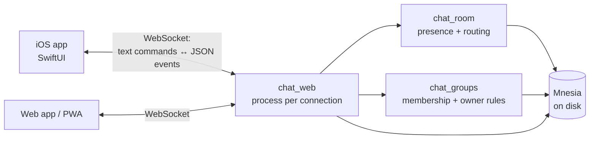

Each connected user is a lightweight Erlang process supervised by OTP — the concurrency model WhatsApp's own
backend is famous for; one bad connection never affects another. There is **no REST API**: clients send
plain-text commands (`/msg`, `/edit`, `/react`, …) and receive JSON events, fully specified in
[PROTOCOL.md](docs/PROTOCOL.md).

## 🚀 Quick start

```bash
git clone https://github.com/smooth-glitch/ember-chat.git && cd ember-chat

# 1. server (needs only Erlang/OTP 26+)
erlc -o ebin -I src src/*.erl
erl -noshell -pa ebin -s chat_app start_web_only 8080      # web app at http://localhost:8080

# 2. iOS app (needs Xcode 26+)
open EmberApp/Ember.xcodeproj                              # pick a team, run on a simulator (⌘R)

# 3. tests: 49 end-to-end checks against a throwaway server
tests/run.sh
```

Windows: `.\build.ps1` then `.\run.ps1`. Hosted: the included `Dockerfile` / `render.yaml` deploy the same
server. Full setup, the iOS server-URL setting, and troubleshooting are in
[DEVELOPMENT.md](docs/DEVELOPMENT.md).

## 🔬 Engineering highlights

Built and hardened by driving the app with scripted clients and screenshots. A few bugs worth reading about
(all have regression tests in [`tests/`](tests/README.md); the write-up is in
[ARCHITECTURE.md](docs/ARCHITECTURE.md#lessons-learned-bugs-that-shaped-the-design)):

- **Message ids reset to 1 on every server restart** — new messages silently overwrote old ones. Now a
  persisted counter seeded from the highest stored id.
- **Emoji like 🌅 ✅ 📅 corrupted messages**: `string:trim` on a byte list stripped a trailing `0x85`,
  producing invalid UTF-8, which made iOS close the socket, which triggered a reconnect loop that
  re-fetched the damaged history. Fixed at the source *and* hardened so the server can never send invalid UTF-8.
- **Any server error logged you out**, and a dropped connection lost your session. Now errors are alerts and
  the client reconnects with backoff and resyncs history.
- **Opening a busy chat froze the UI**: a long animated scroll forced every GIF/link card to load at once.
- **Main-thread GIF decoding**, **HTML-entity-encoded link-preview URLs**, **DMs forgotten after relaunch**,
  and a **database-migration race** — all found and fixed the same way.

## 📚 Documentation

| | |
|---|---|
| [`docs/PROTOCOL.md`](docs/PROTOCOL.md) | Every command and event, limits, HTTP routes, encryption |
| [`docs/ARCHITECTURE.md`](docs/ARCHITECTURE.md) | Process model, data model, iOS state flow, Liquid Glass rules, lessons learned |
| [`docs/DEVELOPMENT.md`](docs/DEVELOPMENT.md) | Setup, running, launch hooks, project-file notes, troubleshooting |
| [`tests/`](tests/README.md) | End-to-end protocol tests (stdlib-only Python) |
| [`tools/demo/`](tools/demo/README.md) | Seeding a demo and regenerating these screenshots |
| [`PROJECT_OVERVIEW.md`](PROJECT_OVERVIEW.md) | Plain-language tour for non-developers |

## 🧭 Roadmap & limitations

- **Voice/video calls** (needs WebRTC signalling + a TURN server) and **push notifications when the app is
  closed** (needs APNs and a paid Apple Developer account) are the two big missing pieces.
- End-to-end encryption covers iOS↔iOS DMs only; groups and the global room are server-readable.
- The web client predates the newer iOS-only features (edit, stories, disappearing messages, group admin);
  the server already supports them.
- Pins, mutes, archive, stars and blocks are per-device (the server doesn't store them).

## 🔒 Security notes

- OAuth credentials live in a local, gitignored file (`src/oauth_config.erl`; template provided) and are never committed.
- Uploads are validated by **magic bytes**, not the declared content type; files are served with `nosniff`.
- The link-preview fetcher refuses private/loopback addresses (SSRF guard) and caps size and time.
- Sign-in never touches a password: Google/Apple confirm identity and the app only receives a name/email.

## Credits

Screenshots use fictional demo accounts, placeholder photos from [Lorem Picsum](https://picsum.photos)
(Unsplash licence) and avatars from [pravatar.cc](https://pravatar.cc); none are stored in this repository.
GIF and sticker search is powered by Giphy.
