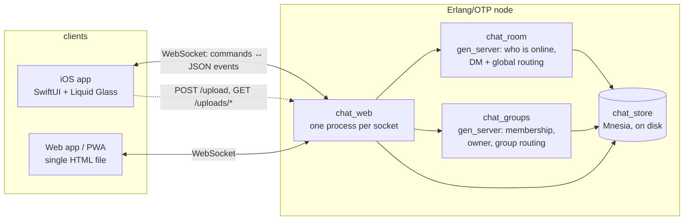
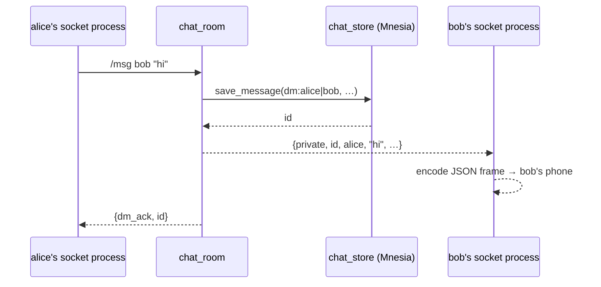

# Architecture

Ember is three programs that share one wire protocol ([`PROTOCOL.md`](PROTOCOL.md)):



Everything on the server is stock Erlang/OTP: the HTTP/WebSocket layer, OAuth, link previews and
persistence are hand-written on `gen_tcp`, `ssl`/`httpc` and Mnesia. There are no dependencies to
fetch, and the whole deploy is a small Dockerfile.

## Server

### Process model

| Module | Role |
|---|---|
| `chat_app`, `chat_app_sup` | Entry point; `one_for_one` supervisor that restarts `chat_room`, `chat_groups` and the listener if they crash. |
| `chat_web_listener`, `chat_web` | Accept loop and **one lightweight process per connection** (HTTP request or WebSocket). A crashing connection cannot affect another user. |
| `chat_room` | `gen_server`: registry of online users (name → socket process), routes DMs / reactions / edits / deletes, broadcasts, runs the 15 s expiry sweep. |
| `chat_groups` | `gen_server`: group membership, owner rules, group fan-out. Resolves member sockets via `chat_room:get_pid/1`. |
| `chat_store` | The only module that touches Mnesia: messages, groups, accounts, profiles, per-conversation settings, status posts. |
| `chat_gif`, `chat_link_preview` | Giphy search; Open Graph fetching (SSRF-guarded: private/loopback ranges refused, size and time limits). |
| `chat_oauth` | Google / Apple sign-in (credentials live in a gitignored `oauth_config.erl`). |

Delivery works by **message passing**: a socket process handles a command, calls `chat_room` /
`chat_groups`, which look up recipients and send each recipient's socket process an Erlang message
(`{group_members, …}`, `{edited, …}`); that process turns it into a JSON frame. So the protocol's
events map one-to-one onto `ws_loop/3` clauses in `chat_web.erl`.



### Data model (Mnesia, `disc_copies`)

| Table | Holds |
|---|---|
| `chat_message` | id, conversation key, sender, text, reactions, reply target, link preview, `deleted`, `edited`, `ts`, `expires` |
| `chat_group` | name, owner, members |
| `conv_setting` | per conversation: disappearing-messages TTL, and for groups the description + icon |
| `user_profile` | avatar URL, status, DM public key, `last_seen` |
| `status_post` | story posts: kind, content, background, expiry, viewers |
| `chat_account` | OAuth identity → username |

Schema changes are handled by `migrate_if_needed/2`: it pads old rows with `[]` for any newly added
field (after waiting for the table to load), so adding a field never needs a manual migration. Code
treats `[]` / `undefined` as "not set".

### Deliberate design choices

- **Ids are a persisted counter**, seeded from the highest id on disk at boot (see *Lessons learned*).
- **Only the author can edit/delete**, enforced in the store, not just the client.
- **Expiry is per message** (`expires` set at save time from the conversation's TTL), so changing the
  timer never rewrites history. Clients also drop expired messages locally at the exact moment, so the
  UI is right even between sweeps.
- **The server treats DM text as opaque**, so end-to-end encryption needed no server changes.

## iOS app (`EmberApp/`)

SwiftUI, iOS 26 deployment target (Liquid Glass), Swift 6 language mode, iPhone + iPad.

```
EmberApp/Ember/
  EmberApp.swift            app entry, RootView (login ↔ list), reconnect banner, server-notice alert
  Networking/
    ChatClient.swift        THE state container: @MainActor @Observable; socket, protocol, every model
    CryptoBox.swift         X25519 key agreement + AES-GCM for DMs (CryptoKit)
    AudioRecorder.swift     voice notes with live metering
  Models/                   ChatMessage, Conversation, StatusPost, MediaResult (plain value types)
  Theme/Theme.swift         colours mirrored from the web CSS variables (light/dark)
  Views/
    ConversationListView    tabs, chat list (+ iPad split view), People, You/settings
    ChatView                message list, glass composer, search, multi-select, forward/reactions sheets
    MessageBubbleView       bubble, reply quote, link card, PDF card, swipe-to-reply
    MessageActionOverlay    long-press reaction bar + action list
    StatusViews             Updates tab, text composer, full-screen story viewer
    LoginView, MediaPickerView, AnimatedGIFView, AudioMessagePlayer
```

### State and data flow

`ChatClient` is the single source of truth. It owns the WebSocket, parses every event in
`handleIncoming`, and exposes plain observable state (`conversations`, `statuses`, `profiles`,
`unreadCounts`, …). Views read it directly; `@Observable` tracks exactly which properties each view
touched, so a reaction changing re-renders that bubble, not the list.

Things worth knowing:

- **Optimistic sends.** The server never echoes your own message back, only its id. The client appends
  immediately with a placeholder id and swaps in the real one on `own_message_id` / `dm_ack`.
- **Reconnect.** A dropped socket moves the client to `.reconnecting` (UI stays on the chat list with a
  glass "Reconnecting…" pill); it retries with 0.5 s → 10 s backoff and, once `welcome` arrives,
  discards stale messages and re-requests history for every chat.
- **Errors vs failure.** A server `error` event is shown as an alert; only a failure to *log in*
  returns you to the login screen.
- **Chat list after relaunch.** `/groups` and `/dms` at login rebuild the list; history is requested for
  each so previews are real.
- **Local-only state** (pins, mutes, archive, stars, blocked users, drafts, unread counts) lives in
  `UserDefaults` / memory. The server has no notion of it; blocking hides messages on this device only.
- **Local notifications** for chats that aren't open (banner + badge, tap opens the chat). True push while
  the app is closed needs APNs and a sender on the server.

### Liquid Glass usage

The rule followed throughout: **glass is for chrome and controls that float over content; content itself
stays solid**, and glass never sits on glass.

- Tab bar and navigation bars use the system iOS 26 glass automatically.
- The **composer** floats over the scroll view (`safeAreaInset`) with `glassEffect(.regular.interactive())`
  buttons grouped in a `GlassEffectContainer` so they blend and morph together; the send button is
  tinted glass (the one prominent action).
- Reaction bar, action list, search bar, banners, day dividers, story controls and the scroll-to-bottom
  button are glass capsules/circles over content.
- Message bubbles, photos and cards are deliberately **not** glass (legibility).
- `ConversationListView` switches to a `NavigationSplitView` in regular width (iPad) with a soft tint for
  the selected chat.

## Web app (`web/`)

One `index.html` (no framework) plus `manifest.json` / `sw.js` for installability. It speaks the same
protocol and mimics Liquid Glass with CSS `backdrop-filter`. It predates the newer iOS-only features
(edit, stories, disappearing messages, group admin) — they are server-supported, so the web client can
adopt them incrementally.

## Lessons learned (bugs that shaped the design)

These were found by running the app against scripted clients, and each has a regression test in `tests/`.

1. **Ids reused after a restart.** Ids came from `erlang:unique_integer/1`, which restarts at 1 with
   every VM start. New messages silently *overwrote* stored ones with the same id and sorted to the top
   of history. Fix: seed a persisted counter from `max(id)` on disk.
2. **`string:trim` chopped emoji.** Incoming text is a list of UTF-8 *bytes*; `string:trim/1` treats the
   list as code points and strips a trailing `0x85` as U+0085 (NEL). That byte ends 🌅 ✅ 📅 🍅 and letters
   like ą, so messages ending in them were cut to invalid UTF-8. iOS closes the socket on an invalid text
   frame, so the app dropped, reconnected, re-requested history — which contained the damaged row — and
   looped. Fix: trim ASCII whitespace only, and sanitise every outgoing frame to valid UTF-8.
3. **Any server error logged you out.** `error` events used to flip the connection state to "failed",
   so "user isn't online" bounced you to the login screen. Fix: errors are alerts; only login failures
   are fatal.
4. **Dropped socket = lost session.** Fix: automatic reconnect + resync (see above).
5. **DMs vanished on relaunch.** The client only knew DMs it had opened this session. Fix: `/dms`.
6. **A long animated scroll froze busy chats.** Opening a chat animated a scroll across thousands of points,
   forcing every GIF and link card on the way to load at once. Fix: `defaultScrollAnchor(.bottom)` plus a
   few silent re-pins while images load; only animate for a single new message.
7. **GIF decoding on the main thread.** Every frame of every GIF was decoded at full size on the UI thread.
   Fix: decode off-thread, 400 px thumbnails, ≤ 60 frames, cached.
8. **HTML entities in link previews.** Some sites encode `og:image` as `https&#x3a;&#x2f;&#x2f;…`; decoded now.
9. **Mnesia migration raced table loading** (`no_exists`) whenever a stored record gained a field; it now
   waits for the table first.

## Limitations & roadmap

- No voice/video calls (needs WebRTC signalling + TURN) and no APNs push (needs Apple's push service and a
  paid developer account).
- End-to-end encryption covers iOS↔iOS DMs only; groups and the global room are server-readable.
- Single-node Mnesia; `dm_partners/1` scans the message table (fine here, would want an index at scale).
- Files: PDFs, photos, GIFs and voice notes only.
- The web client lags the iOS client feature-wise.
